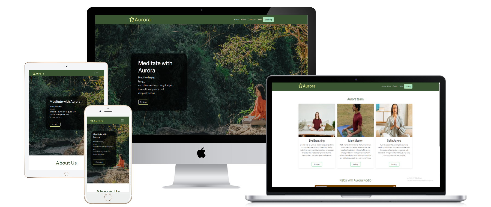
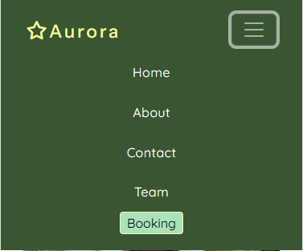
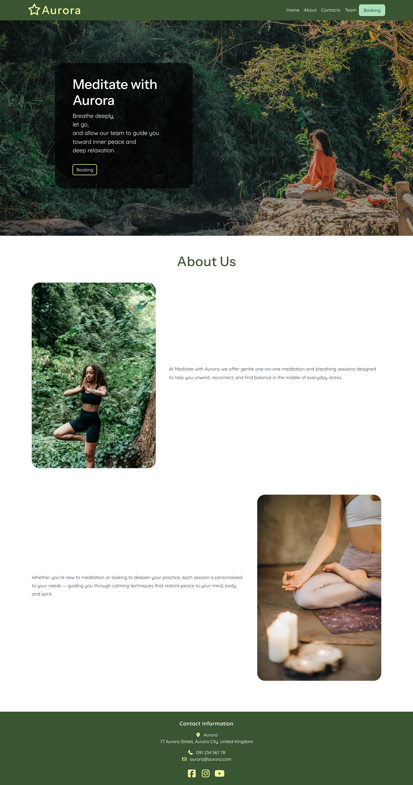
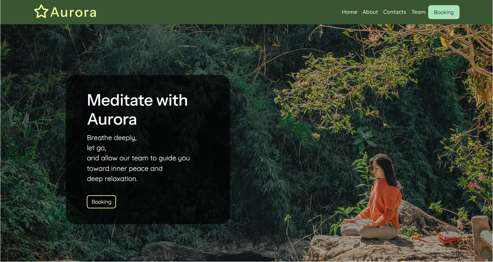

---

# *Meditate with Aurora*
The Meditate with Aurora website allows visitors to learn about the mindfulness company Aurora and explore its guided meditation and breathing sessions. The site provides information about Aurora’s mission, team of professional instructors, and booking options for personalized sessions.

Visitors can easily contact the company, meet the instructors, and even listen to the Aurora Radio playlist to relax and unwind. The website promotes peace, balance, and well-being through calm design, gentle colors, and clear navigation.

The site can be accessed by this [link](https://liepinaievaa-maker.github.io/meditate-with-aurora/index.html)

---

## Features

+ ### Navbar
+ #### Navigation
- Positioned at the top of every page, fixed while scrolling for easy access.
- Contains the Aurora logo on the left side, featuring the brand name with a star icon.
- The right side contains navigation links that guide users through the website:
  - HOME — leads to the main landing page introducing Aurora and its mission.
  - ABOUT — scrolls smoothly to the "About Us" section on the homepage, where users can learn about Aurora’s meditation philosophy.
  - CONTACTS — scrolls to the footer with Aurora’s contact information and social media links.
  - TEAM — leads to a dedicated page introducing Aurora’s meditation instructors and option to listen to Spotify radio of meditations.
  - BOOKING — opens the booking form page where users can schedule a session.
- The Booking button is visually emphasized with a soft green background and rounded edges, creating a clear call-to-action.
- All links include hover effects, smoothly changing color for an interactive and polished user experience.
- The navigation bar remains consistent across all pages, maintaining brand cohesion and clear site structure.
- The navigation is clean, intuitive, and user-friendly, ensuring users can easily explore the website.

 The navigation is fully responsive and adapts to various screen sizes:
  * On Tablets (≤ 768px):
    * The logo remains visible on the left.
    * Navigation links are centered below or toggle into a collapsible menu depending on screen width.
    * All elements maintain proper spacing and visibility for touch-friendly interaction.

 * On Mobile Devices (≤ 480px):
   * The navigation bar features the Aurora logo centered at the top and a hamburger menu on the right.
   * When the hamburger icon is clicked, the menu expands into a vertical dropdown showing all links in the same order.
   * The dropdown background matches the primary green color, ensuring brand consistency and readability.

---

+ ### Homepage
- Represents:
  - The main idea of the company — Aurora, a meditation and breathwork center helping people find calm and inner peace.
  - Emphasizes the core strengths of the brand — experienced teachers, personalized sessions, and peaceful guidance.
  - Encourages users to book a session through the prominent call-to-action buttons.
  - Creates a sense of calm and connection through visual design, warm color palette, and imagery.

---

+ #### Hero Section
 + The Hero Section immediately captures the visitor’s attention with a full-screen background image representing meditation and tranquility.
  + Features:
    + A large hero image covering the entire viewport, set with object-fit: cover to adapt smoothly to all screen sizes.
    + The company name — “Meditate with Aurora”.
    + A short description encouraging visitors to breathe, let go, and find inner peace.
    + A Booking button that leads directly to the booking page for easy access.
 + A subtle brightness filter applied to the background for better text readability.
 + The hero content is centered both vertically and horizontally, ensuring focus and simplicity.

---

