---

# *Meditate with Aurora*
The Meditate with Aurora website allows visitors to learn about the mindfulness company Aurora and explore its guided meditation and breathing sessions. The site provides information about Aurora’s mission, team of professional instructors, and booking options for personalized sessions.

Visitors can easily contact the company, meet the instructors, and even listen to the Aurora Radio playlist to relax and unwind. The website promotes peace, balance, and well-being through calm design, gentle colors, and clear navigation.

The site can be accessed by this [link](https://liepinaievaa-maker.github.io/meditate-with-aurora/index.html)

---

## Features

+ ### Navbar
+ #### Navigation

- Positioned at the top of every page, fixed while scrolling for easy access.
- Contains the Aurora logo on the left side, featuring the brand name with a star icon.

- The right side contains navigation links that guide users through the website:
  - HOME — leads to the main landing page introducing Aurora and its mission.
  - ABOUT — scrolls smoothly to the "About Us" section on the homepage, where users can learn about Aurora’s meditation philosophy.
  - CONTACTS — scrolls to the footer with Aurora’s contact information and social media links.
  - TEAM — leads to a dedicated page introducing Aurora’s meditation instructors and option to listen to Spotify radio of meditations.
  - BOOKING — opens the booking form page where users can schedule a session.

- The Booking button is visually emphasized with a soft green background and rounded edges, creating a clear call-to-action.
- All links include hover effects, smoothly changing color for an interactive and polished user experience.
- The navigation bar remains consistent across all pages, maintaining brand cohesion and clear site structure.
- The navigation is clean, intuitive, and user-friendly, ensuring users can easily explore the website.

 The navigation is fully responsive and adapts to various screen sizes:
  * On Tablets (≤ 768px):
    * The logo remains visible on the left.
    * Navigation links are centered below or toggle into a collapsible menu depending on screen width.
    * All elements maintain proper spacing and visibility for touch-friendly interaction.

 * On Mobile Devices (≤ 480px):
   * The navigation bar features the Aurora logo centered at the top and a hamburger menu on the right.
   * When the hamburger icon is clicked, the menu expands into a vertical dropdown showing all links in the same order.
   * The dropdown background matches the primary green color, ensuring brand consistency and readability.

---

+ ### Homepage

- Represents:
  - The main idea of the company — Aurora, a meditation and breathwork center helping people find calm and inner peace.
  - Emphasizes the core strengths of the brand — experienced teachers, personalized sessions, and peaceful guidance.
  - Encourages users to book a session through the prominent call-to-action buttons.
  - Creates a sense of calm and connection through visual design, warm color palette, and imagery.

---

+ #### Hero Section

 + The Hero Section immediately captures the visitor’s attention with a full-screen background image representing meditation and tranquility.

  + Features:
    + A large hero image covering the entire viewport, set with object-fit: cover to adapt smoothly to all screen sizes.
    + The company name — “Meditate with Aurora”.
    + A short description encouraging visitors to breathe, let go, and find inner peace.
    + A Booking button that leads directly to the booking page for easy access wich is also for call to action section.

 + A subtle brightness filter applied to the background for better text readability.
 + The hero content is centered both vertically and horizontally, ensuring focus and simplicity.

---
+ #### About Section

+ The About Section introduces visitors to Aurora’s philosophy and approach to meditation.

 + Features:
  + Split into two alternating content blocks:
  + Each block contains an image and a paragraph of text.
  + The first block introduces Aurora’s purpose and the calm, gentle environment it provides.
  + The second block explains how sessions are personalized for each participant’s needs.

+ Clean, readable typography and balanced spacing make the section accessible and peaceful to read.
+ Images are rounded and responsive, maintaining their proportion on all devices.

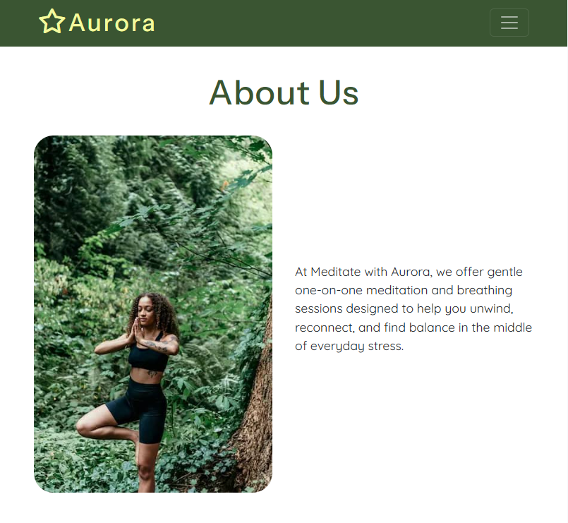

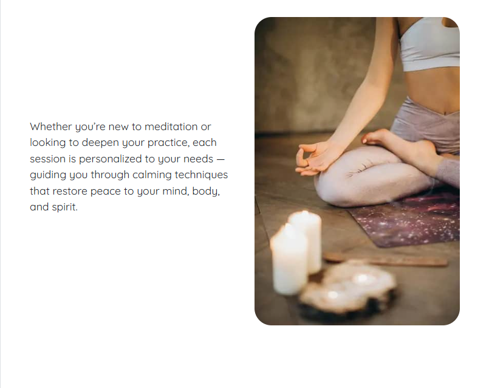

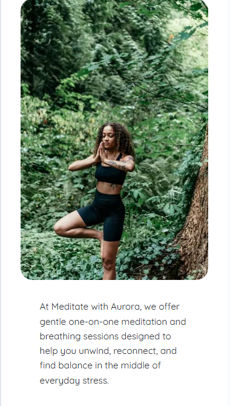

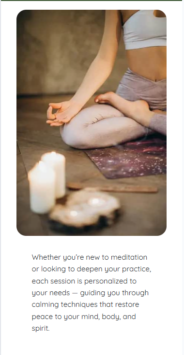
---

+ #### The Footer

+ The Footer is displayed consistently across all pages, keeping contact details and social links easily accessible.

 + Features:
  * Contains Aurora’s address, phone number, and email address.
  * Includes social media icons (Facebook, Instagram, YouTube), each opening in a new tab.
  * The footer background color matches the primary brand color, ensuring visual harmony.
  * Clean, centered layout provides a balanced and professional look.

---

+ ### Team page

+ The Team page highlights the professionals behind Aurora’s meditation sessions.

 + Features:
   + Three team member cards, each including:
   + A professional photo of the instructor.
   + The instructor’s name and specialty.
   + A short bio describing their experience and role in Aurora. 
   + A Booking button linking directly to the session form.
+ Designed to build trust and connection, showing that each teacher has real experience and compassion.
+ Cards are evenly spaced and aligned using Bootstrap’s grid system, ensuring full responsiveness on all screen sizes.

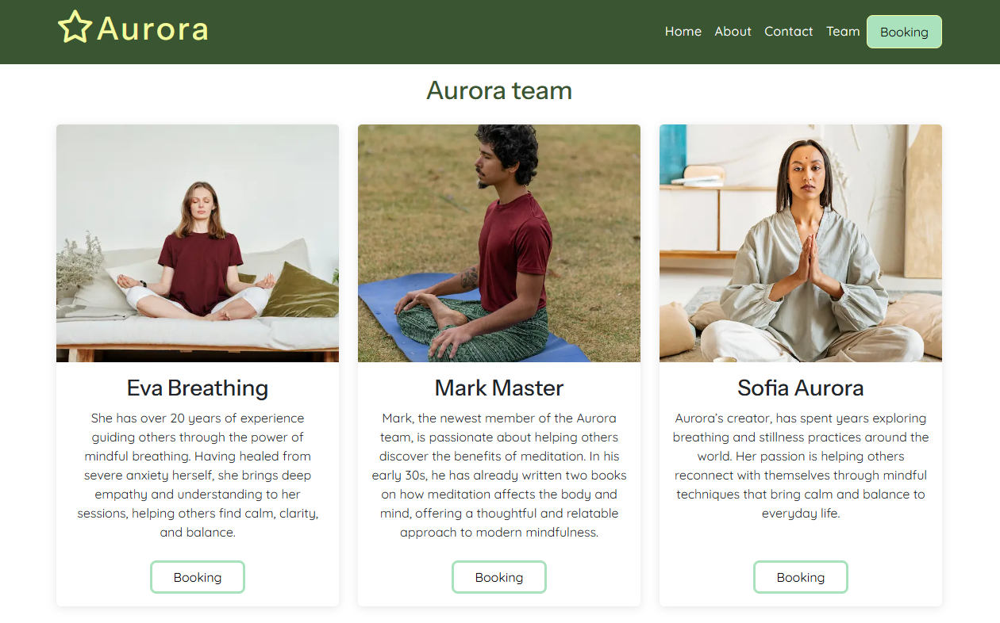
---

+ #### Aurora Radio Section

+ This section invites visitors to relax and experience Aurora’s peaceful atmosphere through music.
  + Features:
   + Integrated Spotify player embedded directly on the page.
   + Title “Relax with Aurora Radio” introducing the feature.
   + Visitors can listen to curated meditation and relaxation playlists while browsing the site.
   + Enhances the emotional connection and sensory experience of the website.
   + Also this section is responsive across different devices.

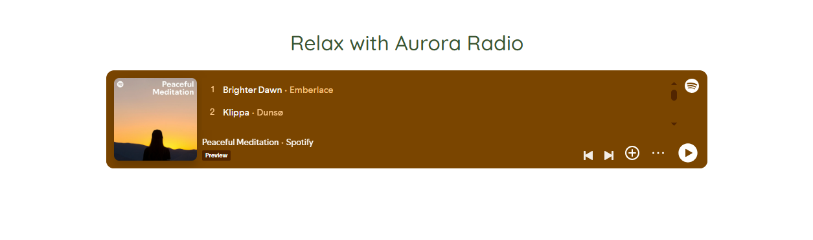
---

 ### Booking page

+ The Booking Page provides a clear and minimal form for visitors to schedule a session.

 + Features:
   + A structured booking form with labeled input fields:
     + Name
     + Phone number
     + Email address 
     + Teacher selection dropdown (Eva, Mark, Sofia) 
     + Message box for additional notes 
  + Includes client-side validation through required fields and semantic input types.
  + Clean design with a white card background, rounded corners, and soft shadow.
  + A Submit button that leads users to the Success page.
  + Encouraging and warm introduction text inviting users to “Take a moment for yourself.”

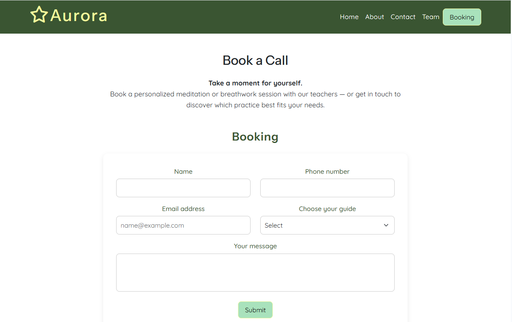
---

 ### Success page

+ A confirmation page thanking the user for their submission.

  + Features:
    + Large heading “Thank you!” and a message confirming that the form was successfully submitted.
    + A Return to Home Page button leading back to the main site.
    + Minimalist design matching the brand’s calm aesthetic.

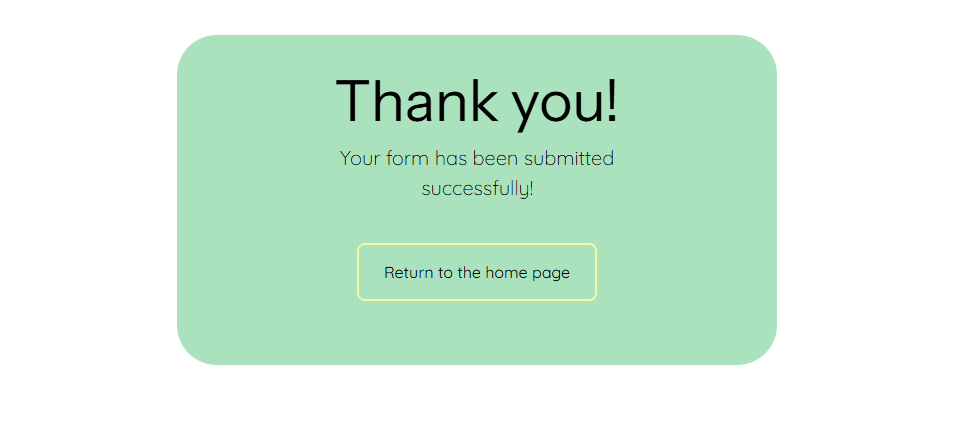
---
 ## Features Left to Implement for Future

+ Testimonials Section
  + Add a dedicated section where Aurora’s clients can share their feedback and stories about their meditation experiences. This will help build trust and showcase the positive impact of Aurora’s sessions.

+ Interactive Schedule Calendar
  + Implement a live booking calendar that shows available dates and time slots, allowing users to book their preferred session directly.

+ Audio Library Page
  + Develop a dedicated section where users can listen to Aurora’s guided meditations and relaxation music directly from the website, without needing to access external platforms.

+ Custom Navigation Bar (Without Bootstrap)
  + In the future, I would like to rebuild the navigation bar completely from scratch instead of relying on Bootstrap’s default components.
  + The Bootstrap navbar caused several styling and responsiveness issues during development, especially when adjusting for smaller screens.
  + Creating a fully custom version will give me more design control, simplify the structure, and ensure consistent behavior across all devices.

+ Custom Booking Form Implementation
  + The current booking form uses Bootstrap elements for layout and styling.
  + In the future, I plan to design and code the booking section independently — with fully customized form fields, validation, and a smoother user flow.
  + Building it without Bootstrap will help eliminate layout conflicts and make the section visually more aligned with Aurora’s calming and minimal design style.
---

+ ## Testing

+ Extensive testing was carried out throughout the development process to ensure that the Aurora Meditation website functions correctly, is visually consistent, and provides a smooth user experience across different devices and browsers.

+ The site has been tested manually on various screen sizes and browsers to confirm that all features work as intended and that users can easily achieve their goals — whether it’s reading about Aurora, meeting the team, or booking a session.

 ### General Functionality Testing

  + All navigation links across the site work correctly and lead to the intended pages or sections.
  + The fixed navigation bar remains visible and functional during scrolling.
  + The hero section image loads properly on all devices, with responsive text and working call-to-action button.
  + The “About” section displays correctly with images aligned as intended and text remaining readable at all breakpoints.
  + The “Team” page cards are responsive and visually balanced.
  + The “Booking” page form accepts input, validates required fields, and successfully redirects to the success confirmation page.
  + The “Success” page correctly confirms submission and links back to the homepage.
  + Footer social media icons open in a new tab and direct users to the correct platforms.
  + All components were also tested for proper alignment, spacing, and font rendering on both desktop and mobile devices.
---

 ### Browser and Device Compatibility
+ The project was tested on the following browsers and operating systems:
  + Google Chrome (Desktop & Mobile)
  + Mozilla Firefox
  + Microsoft Edge
  + Safari (iOS)

+ All pages displayed as expected on:
  + Desktop (Full HD & 4K)
  + Tablet (768px width)
  + Mobile Devices (480px and smaller)

+ The website’s responsiveness was verified using Chrome DevTools and actual physical devices to ensure consistent layout behavior across breakpoints.
---
 ### Performance and Accessibility

+ Performance, accessibility, and best practices were tested using Google Lighthouse.
The site scored highly in all categories, confirming that the structure, contrast ratios, and meta tags are well-optimized.

+ Accessibility was also reviewed manually:
  + All images include descriptive alt attributes.
  + Proper heading hierarchy (h1, h2, h3, etc.) is maintained across pages.
  + Links and buttons are clearly distinguishable and include hover feedback.

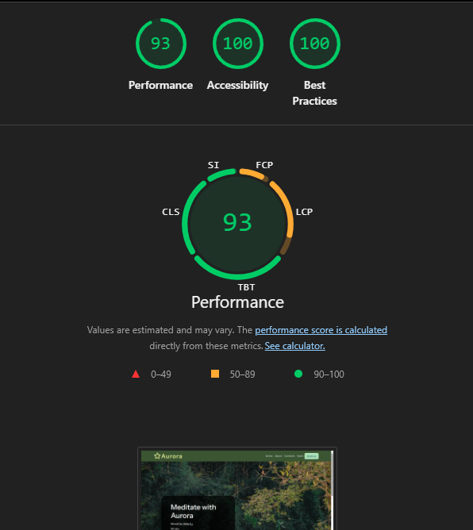
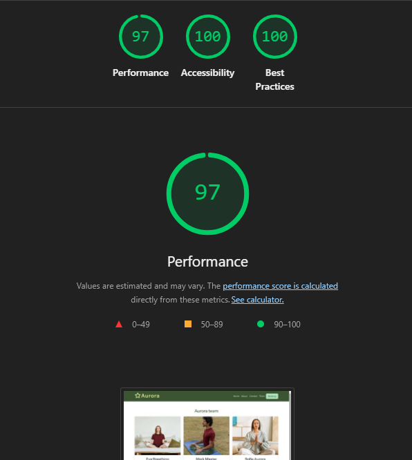
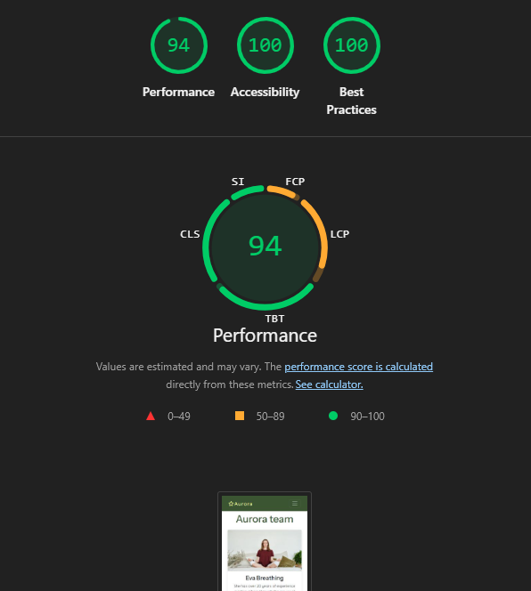
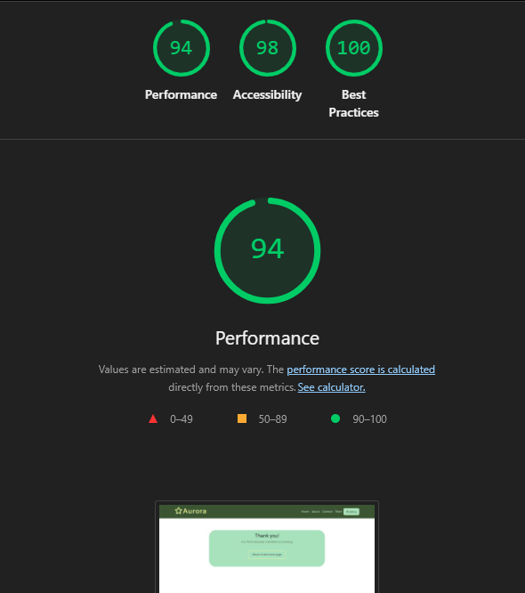
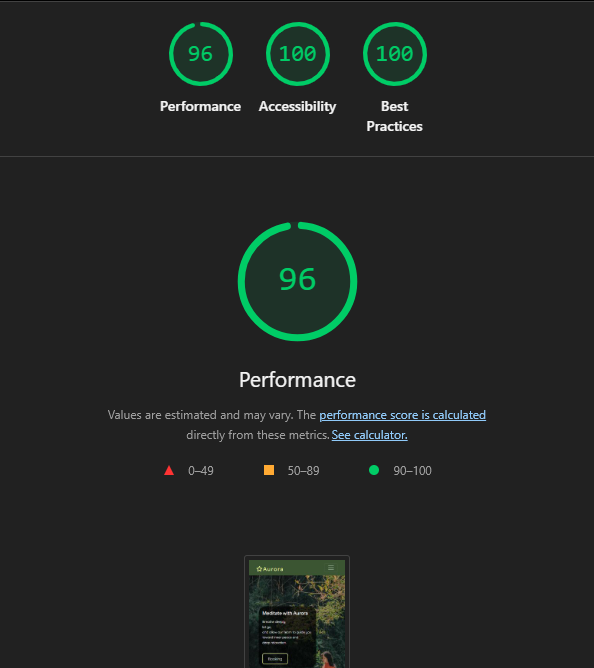

---
 ### Validator Testing

+ HTML 
  + All pages were tested using the [W3C Markup Validation Service](https://validator.w3.org/nu/?doc=https%3A%2F%2Fliepinaievaa-maker.github.io%2Fmeditate-with-aurora%2Findex.html)
  + No errors or critical warnings were returned.
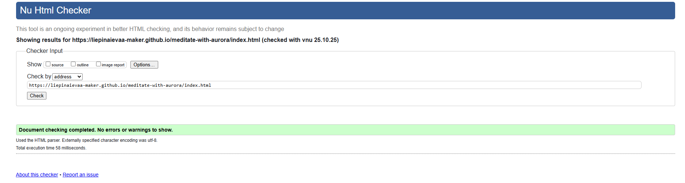

+ CSS
  + The CSS file was validated using the [W3C Jigsaw CSS Validator](https://jigsaw.w3.org/css-validator/validator?uri=https%3A%2F%2Fliepinaievaa-maker.github.io%2Fmeditate-with-aurora%2Findex.html&profile=css3svg&usermedium=all&warning=1&vextwarning=&lang=el)
  + The stylesheet has no errors, only minor warnings about CSS variables and vendor prefixes (which are normal and acceptable in modern web design) and they mostly are because of used Bootstrap.
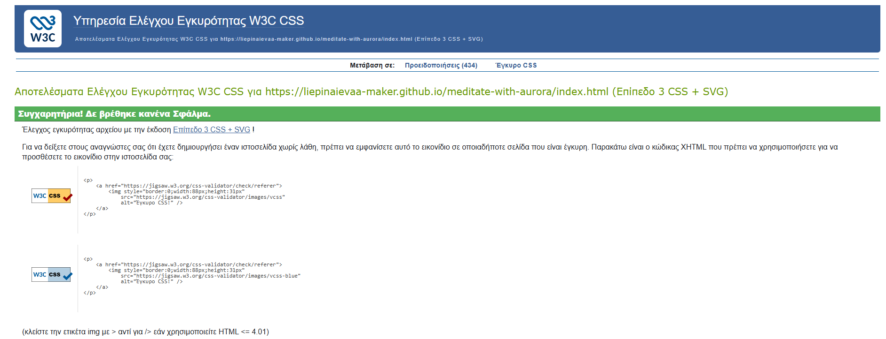
---
### Manual Testing
| Hero Section |||||
| Hero image | Load homepage | Image covers full width and adjusts to screen size | Yes | Yes | Minor adjustments made to fix white space bug |
| Hero text | View on different screen sizes | Text remains centered and readable | Yes | Yes | Adjusted padding and font size for mobile |
| “Booking” button | Click the button | User is redirected to Booking page | Yes | Yes | Works as intended |

| About Section |||||
| About images | View on desktop and mobile | Images resize and align properly | Yes | Yes | Optimized using Squoosh for faster loading |
| About text | Read text content | Text is readable and balanced on all screens | Yes | Yes | Responsive layout confirmed |

| Team Page |||||
| Team cards | View all team members | Cards are displayed evenly in grid format | Yes | Yes | - |
| Card images | Hover over image | Image remains centered; no distortion | Yes | Yes | - |
| Booking button on each card | Click “Booking” button | User is redirected to Booking page | Yes | Yes | - |

| Booking Page |||||
| Name input | Enter text | Text appears correctly | Yes | Yes | Required field works |
| Phone input | Enter numbers | Input accepted | Yes | Yes | - |
| Email input | Enter valid/invalid email | Valid email accepted; invalid rejected | Yes | Yes | Browser validation works |
| Teacher dropdown | Select guide from list | Option selected correctly | Yes | Yes | - |
| Message area | Type message | Text appears and scrolls correctly | Yes | Yes | - |
| Submit button | Click “Submit” | User redirected to Success page | Yes | Yes | - |

| Success Page |||||
| Confirmation message | Load success page | “Thank you” message displayed clearly | Yes | Yes | - |
| Return button | Click “Return to Home Page” | Redirects back to homepage | Yes | Yes | Works smoothly |

| Footer |||||
| Facebook icon | Click icon | Opens Facebook in new tab | Yes | Yes | Uses target="_blank" correctly |
| Instagram icon | Click icon | Opens Instagram in new tab | Yes | Yes | - |
| YouTube icon | Click icon | Opens YouTube in new tab | Yes | Yes | - |
| Contact info | View text | Address, email, and phone readable and clickable | Yes | Yes | Consistent across all pages |
---

 ### Bugs

+ Although the website works well overall, a few small issues were discovered during development and testing:

  + Hero Image Width Issue:

    + The main hero image initially appeared too wide on larger screens, slightly extending beyond the viewport and causing unwanted horizontal scrolling.
    + My goal was to have the image fill the entire width of the screen without leaving any white borders — but this occasionally conflicted with Lighthouse’s layout and responsiveness requirements.
    + After several adjustments to object-fit and object-position, the issue was minimized, and the image now displays correctly across all major devices.  
    + However, a very small discrepancy remains at some unusual screen sizes, which I plan to perfect in future updates.

  + Image Optimization for Lighthouse Performance:

    + Early Lighthouse tests showed a slightly reduced performance score due to large image file sizes.
    + To fix this, I used the external website [Squoosh](https://squoosh.app/) to compress and resize all images without losing quality.
    + After optimization, the site loads much faster, and the Lighthouse performance score improved significantly.

+ A few areas have been noted for improvement in future development:

  + Bootstrap Navbar Responsiveness:
    + During testing, minor layout issues appeared on certain screen widths (particularly between 768px–992px). These are caused by Bootstrap’s predefined flex behaviors. The plan is to rebuild the navigation bar from scratch in the future for more predictable styling.

  + Bootstrap Booking Form Layout:
    + Some alignment inconsistencies occur when resizing the window rapidly. This issue also stems from Bootstrap’s grid system. A fully custom-built booking form will replace this version to ensure smoother responsiveness.

+ No functional bugs remain unresolved, and all interactive elements currently work as intended.
---

 ## Deployment

 ###  Deployment to GitHub Pages

+ The Aurora Meditation website was deployed using GitHub Pages for easy public access and hosting.
  + Steps to deploy:
  1. In the GitHub repository, navigate to the Settings tab.
  2. Scroll down to the Pages section on the left-hand side.
  3. Under Source, open the drop-down menu and select the Main branch.
  4. Click Save to confirm the selection.
  5. After a few moments, GitHub Pages will automatically build and publish the website.
  6. A success ribbon will appear at the top of the page, displaying the deployment link.

  + Once the process was complete, the site was live and accessible on the web.
   
   + Live link: [Aurora Meditation on GitHub Pages](https://liepinaievaa-maker.github.io/meditate-with-aurora/)
---

#### Local Deployment

+ If you wish to make a local copy of the Aurora Meditation project, you can clone the repository directly to your machine.
 + Steps to clone:
  1. Navigate to the main page of the repository on GitHub.
  2. Click the green Code button.
  3. Copy the URL provided under the HTTPS option.
  4. Open your preferred IDE terminal (for example, VS Code or Gitpod).
  5. Type the following command:
     git clone https://github.com/yourusername/aurora-meditation.git
  6. Press Enter to create a local clone of the project.
  7. Once cloned, you can open the project in your IDE, and use Live Server (or a similar extension) to preview the site locally.
---

+ #### Updating the Live Site

 + Any future updates pushed to the main branch will automatically be reflected on GitHub Pages.
To ensure a smooth update process:

   + Commit and push changes using Git.
   + Wait a few minutes for GitHub Pages to rebuild the site.
   + Refresh your live page to view the new version.

---

