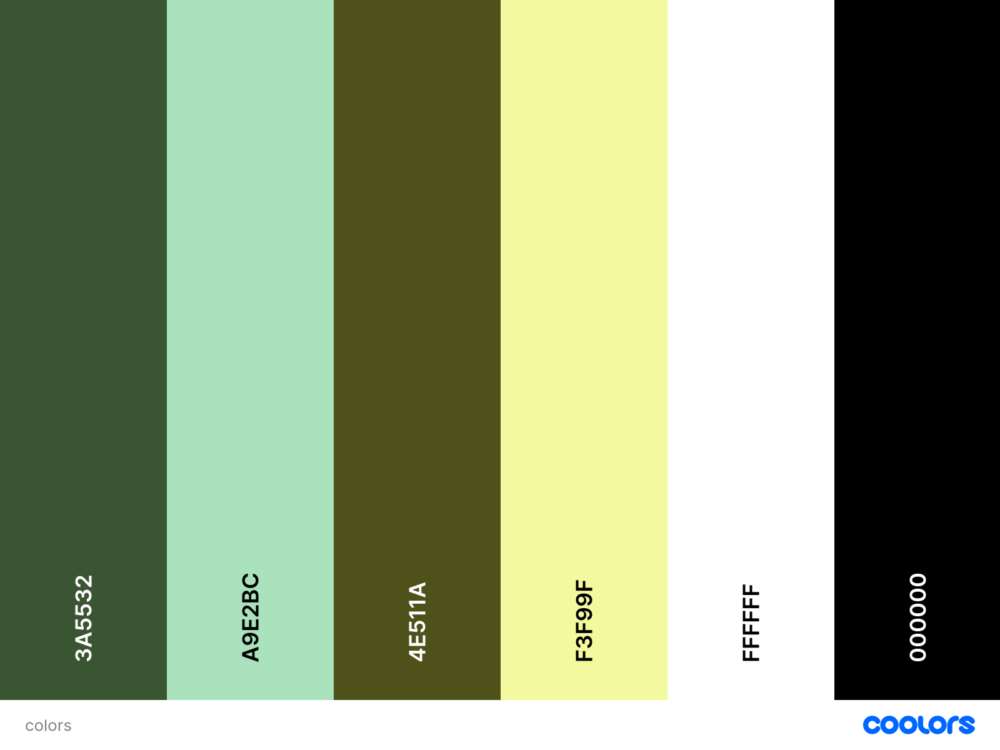
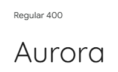
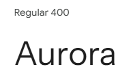

---

# *Meditate with Aurora*
The Meditate with Aurora website allows visitors to learn about the mindfulness company Aurora and explore its guided meditation and breathing sessions. The site provides information about Aurora’s mission, team of professional instructors, and booking options for personalized sessions.

Visitors can easily contact the company, meet the instructors, and even listen to the Aurora Radio playlist to relax and unwind. The website promotes peace, balance, and well-being through calm design, gentle colors, and clear navigation.

The site can be accessed by this [link](https://liepinaievaa-maker.github.io/meditate-with-aurora/index.html)

---

## Features

+ ### Navbar
+ #### Navigation

- Positioned at the top of every page, fixed while scrolling for easy access.
- Contains the Aurora logo on the left side, featuring the brand name with a star icon.

- The right side contains navigation links that guide users through the website:
  - HOME — leads to the main landing page introducing Aurora and its mission.
  - ABOUT — scrolls smoothly to the "About Us" section on the homepage, where users can learn about Aurora’s meditation philosophy.
  - CONTACTS — scrolls to the footer with Aurora’s contact information and social media links.
  - TEAM — leads to a dedicated page introducing Aurora’s meditation instructors and option to listen to Spotify radio of meditations.
  - BOOKING — opens the booking form page where users can schedule a session.

- The Booking button is visually emphasized with a soft green background and rounded edges, creating a clear call-to-action.
- All links include hover effects, smoothly changing color for an interactive and polished user experience.
- The navigation bar remains consistent across all pages, maintaining brand cohesion and clear site structure.
- The navigation is clean, intuitive, and user-friendly, ensuring users can easily explore the website.

 The navigation is fully responsive and adapts to various screen sizes:
  * On Tablets (≤ 768px):
    * The logo remains visible on the left.
    * Navigation links are centered below or toggle into a collapsible menu depending on screen width.
    * All elements maintain proper spacing and visibility for touch-friendly interaction.

 * On Mobile Devices (≤ 480px):
   * The navigation bar features the Aurora logo centered at the top and a hamburger menu on the right.
   * When the hamburger icon is clicked, the menu expands into a vertical dropdown showing all links in the same order.
   * The dropdown background matches the primary green color, ensuring brand consistency and readability.

---

+ ### Homepage

- Represents:
  - The main idea of the company — Aurora, a meditation and breathwork center helping people find calm and inner peace.
  - Emphasizes the core strengths of the brand — experienced teachers, personalized sessions, and peaceful guidance.
  - Encourages users to book a session through the prominent call-to-action buttons.
  - Creates a sense of calm and connection through visual design, warm color palette, and imagery.

---

+ #### Hero Section

 + The Hero Section immediately captures the visitor’s attention with a full-screen background image representing meditation and tranquility.

  + Features:
    + A large hero image covering the entire viewport, set with object-fit: cover to adapt smoothly to all screen sizes.
    + The company name — “Meditate with Aurora”.
    + A short description encouraging visitors to breathe, let go, and find inner peace.
    + A Booking button that leads directly to the booking page for easy access wich is also for call to action section.

 + A subtle brightness filter applied to the background for better text readability.
 + The hero content is centered both vertically and horizontally, ensuring focus and simplicity.

---
+ #### About Section

+ The About Section introduces visitors to Aurora’s philosophy and approach to meditation.

 + Features:
  + Split into two alternating content blocks:
  + Each block contains an image and a paragraph of text.
  + The first block introduces Aurora’s purpose and the calm, gentle environment it provides.
  + The second block explains how sessions are personalized for each participant’s needs.

+ Clean, readable typography and balanced spacing make the section accessible and peaceful to read.
+ Images are rounded and responsive, maintaining their proportion on all devices.

---

+ #### The Footer

+ The Footer is displayed consistently across all pages, keeping contact details and social links easily accessible.

 + Features:
  * Contains Aurora’s address, phone number, and email address.
  * Includes social media icons (Facebook, Instagram, YouTube), each opening in a new tab.
  * The footer background color matches the primary brand color, ensuring visual harmony.
  * Clean, centered layout provides a balanced and professional look.

---

+ ### Team page

+ The Team page highlights the professionals behind Aurora’s meditation sessions.

 + Features:
   + Three team member cards, each including:
   + A professional photo of the instructor.
   + The instructor’s name and specialty.
   + A short bio describing their experience and role in Aurora. 
   + A Booking button linking directly to the session form.
+ Designed to build trust and connection, showing that each teacher has real experience and compassion.
+ Cards are evenly spaced and aligned using Bootstrap’s grid system, ensuring full responsiveness on all screen sizes.

---

+ #### Aurora Radio Section

+ This section invites visitors to relax and experience Aurora’s peaceful atmosphere through music.
  + Features:
   + Integrated Spotify player embedded directly on the page.
   + Title “Relax with Aurora Radio” introducing the feature.
   + Visitors can listen to curated meditation and relaxation playlists while browsing the site.
   + Enhances the emotional connection and sensory experience of the website.
   + Also this section is responsive across different devices.

---

 ### Booking page

+ The Booking Page provides a clear and minimal form for visitors to schedule a session.

 + Features:
   + A structured booking form with labeled input fields:
     + Name
     + Phone number
     + Email address 
     + Teacher selection dropdown (Eva, Mark, Sofia) 
     + Message box for additional notes 
  + Includes client-side validation through required fields and semantic input types.
  + Clean design with a white card background, rounded corners, and soft shadow.
  + A Submit button that leads users to the Success page.
  + Encouraging and warm introduction text inviting users to “Take a moment for yourself.”

---

 ### Success page

+ A confirmation page thanking the user for their submission.

  + Features:
    + Large heading “Thank you!” and a message confirming that the form was successfully submitted.
    + A Return to Home Page button leading back to the main site.
    + Minimalist design matching the brand’s calm aesthetic.

---

## Technologies used

+ [HTML5](https://developer.mozilla.org/en-US/docs/Web/Guide/HTML/HTML5) - provided the main structure and content for all pages across the website.
+ [CSS3](https://developer.mozilla.org/en-US/docs/Web/CSS) - used to style the project, add color schemes, typography, spacing, and layout adjustments.
+ [CSS Flexbox](https://developer.mozilla.org/en-US/docs/Web/CSS/flex) - applied to align and organize sections neatly, keeping the layout consistent on different screen sizes.
+ [CSS Media Queries](https://developer.mozilla.org/en-US/docs/Web/CSS/Media_Queries/Using_media_queries) - used to ensure full responsiveness for desktop, tablet, and mobile devices.
+ [CSS Variables (Root)](https://developer.mozilla.org/en-US/docs/Web/CSS/Using_CSS_custom_properties) - created for easy color and font management throughout the entire website.
+ [Bootstrap 5](https://getbootstrap.com/) - used mainly for the navigation bar, responsive grid layout, and booking form elements.
+ [Font Awesome](https://fontawesome.com/) - provided all icons used on the site, including the star in the logo and social media icons in the footer.
+ [Favicon Generator](https://favicon.io/) - used to create the custom favicon for consistent branding across browsers and devices.
+ [Squoosh](https://squoosh.app/) - used to compress and resize images, improving loading time and Lighthouse performance.
+ [Git](https://git-scm.com/) - used for version control to manage updates and track all project changes.
+ [GitHub](https://github.com/) - used to store the project’s repository and host the live site via GitHub Pages.
+ [Visual Studio Code](https://code.visualstudio.com/) - used as the main development environment for writing and editing code.
+ [Emmet](https://docs.emmet.io/cheat-sheet/) was used within VS Code to speed up the HTML and CSS workflow, allowing faster and more efficient coding through shorthand syntax.
+ [Code Institute](https://codeinstitute.net/) course materials and examples were used as guidance for building structure, accessibility, and responsive design.

---

## Design

### Color Scheme

+ The color palette for the Aurora website was carefully chosen to reflect calmness, balance, and a sense of natural harmony — values at the heart of meditation and breathwork.

 + Dark Green (#3a5532) was used as the primary color throughout the site to symbolize grounding, nature, and emotional stability. It also provides strong contrast for readability.
 + Soft Green (#a9e2bc) serves as the secondary color, creating a gentle and welcoming feeling that complements the darker tones and brings freshness to the layout.
 + Muted Yellow-Green (#4e511a) acts as a highlight color, drawing subtle attention to interactive elements such as buttons and icons without being overwhelming.
 + Light Yellow (#f3f99f) was used as a background and accent shade to brighten sections and add a peaceful, uplifting atmosphere.
 + White and Black — included as neutral base tones to ensure clarity, readability, and clean visual contrast across sections.

+ Together, these natural tones create a sense of serenity and connection to nature, perfectly aligning with Aurora’s philosophy of mindfulness and balance.

---

### Typography

+ Main Font — Quicksand
  + This soft, rounded sans-serif font was chosen for body text because it is friendly, easy to read, and adds a warm human touch to the site’s overall feeling.

+ Accent Font — Instrument Sans
  + Used for headings and titles, this clean and elegant font brings a sense of structure and confidence while keeping the design modern and minimal.

+ The combination of both fonts ensures excellent readability while maintaining a relaxed and approachable tone throughout the website.

---

 ## Features Left to Implement for Future

+ Testimonials Section
  + Add a dedicated section where Aurora’s clients can share their feedback and stories about their meditation experiences. This will help build trust and showcase the positive impact of Aurora’s sessions.

+ Interactive Schedule Calendar
  + Implement a live booking calendar that shows available dates and time slots, allowing users to book their preferred session directly.

+ Audio Library Page
  + Develop a dedicated section where users can listen to Aurora’s guided meditations and relaxation music directly from the website, without needing to access external platforms.

+ Custom Navigation Bar (Without Bootstrap)
  + In the future, I would like to rebuild the navigation bar completely from scratch instead of relying on Bootstrap’s default components.
  + The Bootstrap navbar caused several styling and responsiveness issues during development, especially when adjusting for smaller screens.
  + Creating a fully custom version will give me more design control, simplify the structure, and ensure consistent behavior across all devices.

+ Custom Booking Form Implementation
  + The current booking form uses Bootstrap elements for layout and styling.
  + In the future, I plan to design and code the booking section independently — with fully customized form fields, validation, and a smoother user flow.
  + Building it without Bootstrap will help eliminate layout conflicts and make the section visually more aligned with Aurora’s calming and minimal design style.
---

## Testing

+  For a full overview of how the project was tested and the results of each section, you can read more in the [TESTING.md](TESTING.md) file.
---

 ## Deployment

 ###  Deployment to GitHub Pages

+ The Aurora Meditation website was deployed using GitHub Pages for easy public access and hosting.
  + Steps to deploy:
  1. In the GitHub repository, navigate to the Settings tab.
  2. Scroll down to the Pages section on the left-hand side.
  3. Under Source, open the drop-down menu and select the Main branch.
  4. Click Save to confirm the selection.
  5. After a few moments, GitHub Pages will automatically build and publish the website.
  6. A success ribbon will appear at the top of the page, displaying the deployment link.

  + Once the process was complete, the site was live and accessible on the web.
   
   + Live link: [Aurora Meditation on GitHub Pages](https://liepinaievaa-maker.github.io/meditate-with-aurora/)
---

#### Local Deployment

+ If you wish to make a local copy of the Aurora Meditation project, you can clone the repository directly to your machine.
 + Steps to clone:
  1. Navigate to the main page of the repository on GitHub.
  2. Click the green Code button.
  3. Copy the URL provided under the HTTPS option.
  4. Open your preferred IDE terminal (for example, VS Code or Gitpod).
  5. Type the following command:
     git clone https://github.com/yourusername/aurora-meditation.git
  6. Press Enter to create a local clone of the project.
  7. Once cloned, you can open the project in your IDE, and use Live Server (or a similar extension) to preview the site locally.
---

+ #### Updating the Live Site

 + Any future updates pushed to the main branch will automatically be reflected on GitHub Pages.
To ensure a smooth update process:

   + Commit and push changes using Git.
   + Wait a few minutes for GitHub Pages to rebuild the site.
   + Refresh your live page to view the new version.

---
## Credits

### Content

 + Most of written content across the Aurora Meditation website (Home, Team, and Booking pages) was created and edited by me specifically for this project and as well: 
   + Some text structure, proofreading, and section descriptions were generated and refined with the help of [ChatGPT by OpenAI](https://chatgpt.com/) to improve clarity and consistency, especially for READ.me.

 + Some layout ideas and structure were inspired by Code Institute learning materials, which helped ensure accessibility, responsiveness, and semantic HTML practices.
 + The navigation bar and booking form were developed using Bootstrap 5, which served as the foundation for responsive design and layout consistency.
 + The icons used throughout the project, including the logo star and social media icons in the footer, were sourced from [Font Awesome](https://fontawesome.com/)
 + I also made use of HTML, CSS, and [Bootstrap](https://getbootstrap.com/) documentation for troubleshooting and improving site performance.
 ---

 ### Media

 + All images used on the site were sourced from [Pexels](https://www.pexels.com/) — a free and open-source image platform.
 + Images were resized and optimized using [Squoosh](https://squoosh.app/) to reduce file size and improve Lighthouse performance scores.
 + The website’s favicon was created using the [Favicon Generator](https://favicon.io/) for consistent branding across browsers and devices.
 + The [cooler](https://coolors.co/) was used to create colour palette for README.md file
 + [Google Fonts](https://fonts.google.com/selection/embed) was used to import the Instrument Sans and Quicksand typefaces, which together create a calm, modern, and balanced visual style consistent with Aurora’s branding.

 ---

 ### Acknowledgments

 + I would like to thank my friend, Anita Teclava, for her creative input, feedback, and encouragement throughout the design process.
 + My sincere gratitude to my mentor, Julia Konovalova, for her invaluable advice, technical guidance, and support during the project and also for sharing her projects for insoiration for README.md, which helped me a lot to write evrything correctly.
 + A big thank you to the Code Institute team, whose structured materials, resources, and examples were instrumental in helping me complete this project successfully.
 ---

